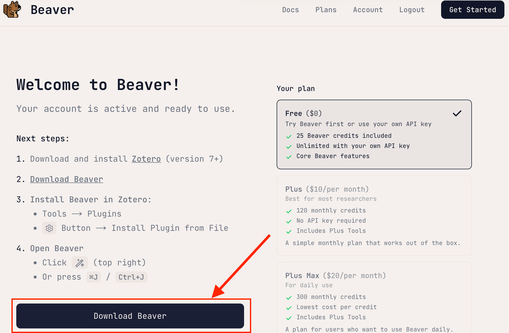
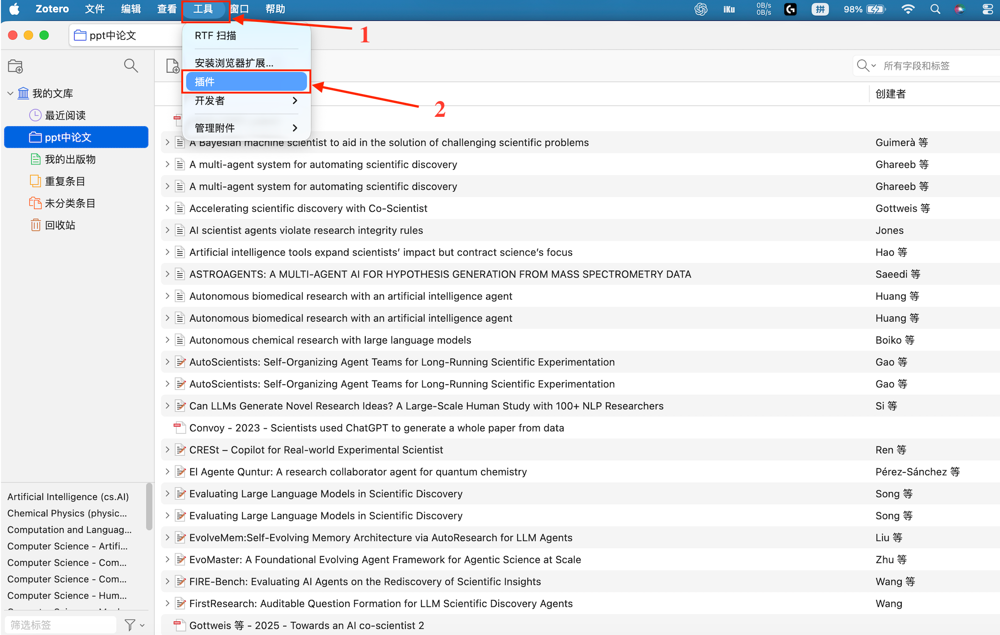
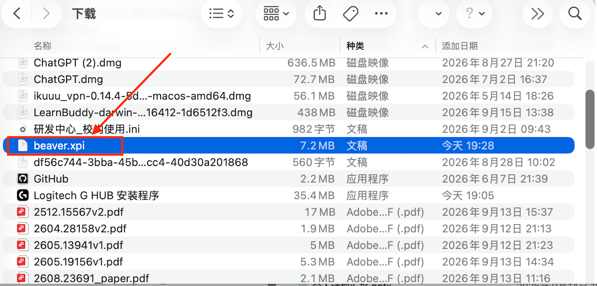
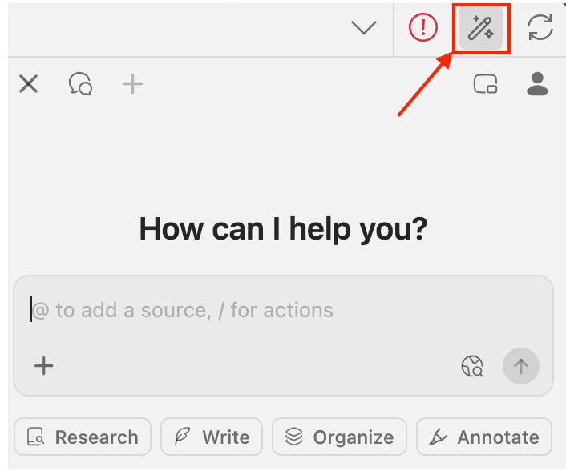
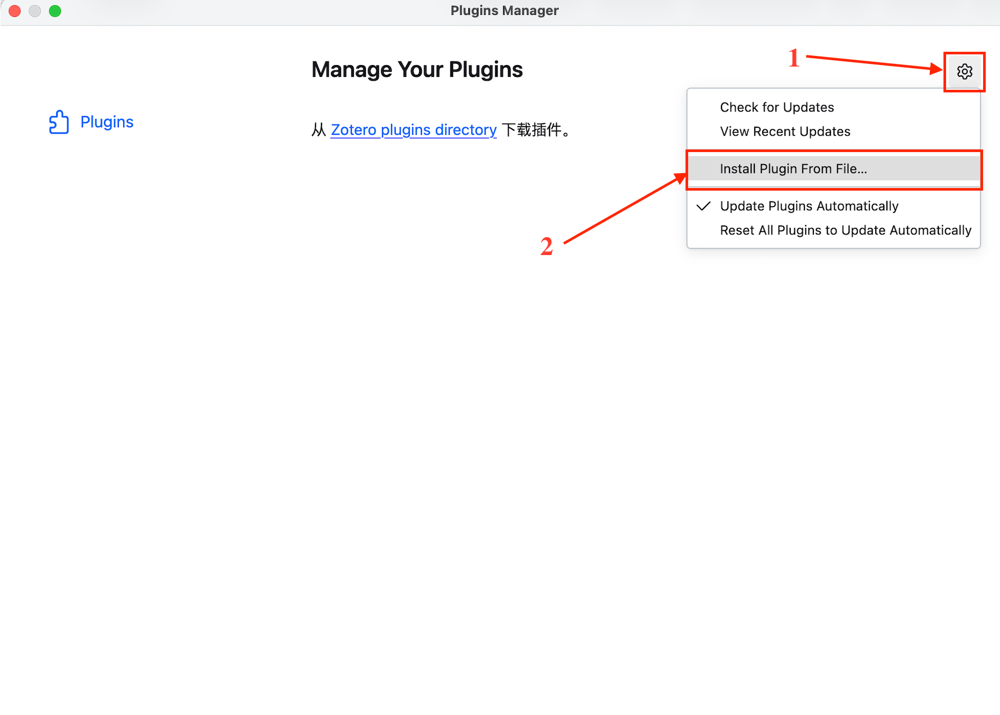

# Zotero 与 Beaver 安装教程

如果你是第一次接触文献管理，建议按这个顺序来：**先安装 Zotero，再安装 Beaver**。

Zotero 负责收集、整理和引用文献；Beaver 则是运行在 Zotero 里的 AI 阅读助手，可以搜索你的文献库，并针对论文内容进行提问。Beaver 不能脱离 Zotero 单独使用。

> 本教程依据 2026 年 9 月可查到的官方说明编写。软件界面可能会随版本更新略有变化。

## 一、安装 Zotero

### 1. 下载 Zotero

打开 [Zotero 官方下载页面](https://www.zotero.org/downloads)。网站通常会自动识别你的操作系统，你也可以手动选择对应版本。

- 普通 Windows 电脑一般选择 **Windows 64-bit Installer**；
- Windows ARM 设备选择 **ARM Installer**；
- Mac 用户选择 **macOS** 版本；
- Linux 用户根据处理器架构选择对应版本。

如果你只是日常使用，安装正式版即可，没有必要选择 Beta 测试版。

### 2. Windows 安装方法

1. 下载 Windows 安装程序；
2. 双击安装文件；
3. 按照向导完成安装，通常保留默认选项就可以；
4. 安装完成后打开 Zotero。

### 3. macOS 安装方法

1. 下载 macOS 版 Zotero；
2. 打开下载好的安装文件；
3. 将 Zotero 拖进“应用程序”文件夹；
4. 从“应用程序”中启动 Zotero。

第一次打开时，如果系统提示这是从互联网下载的应用，请确认文件来自 Zotero 官网，然后选择打开。

### 4. Linux 安装方法

在官方下载页选择与你的处理器架构相符的 Linux 版本，下载并解压，再按照压缩包中的说明启动或安装。

部分 Linux 发行版也提供社区维护的软件包，但版本不一定是最新的。想省心一些，优先使用 Zotero 官网提供的安装包。

## 二、安装 Zotero Connector

Zotero Connector 是浏览器扩展。装好以后，浏览网页、期刊页面或论文详情页时，只要点一下浏览器工具栏中的 Zotero 图标，就能把文献信息保存到 Zotero。

1. 打开 [Zotero 下载页面](https://www.zotero.org/downloads)；
2. 找到 **Zotero Connector**；
3. 根据自己的浏览器安装 Chrome、Firefox、Edge 或 Safari 版本；
4. 安装完成后，建议把 Zotero 图标固定在浏览器工具栏上。

Safari 版 Connector 会随 Zotero 一起提供。如果工具栏上没有图标，可以进入 Safari 的扩展设置手动启用。

## 三、首次使用时可以顺手做的设置

### 登录同步账号

你可以注册一个 Zotero 账号，然后在 Zotero 设置中登录。这样，文献条目和笔记可以在不同设备之间同步。

需要注意的是，Zotero 免费附件空间有限。如果 PDF 文件很多，可以以后再考虑配置 WebDAV 或购买额外存储；刚开始使用时，不必急着处理这一项。

### 检查 Word 插件

Word、LibreOffice 和 Google Docs 的引用功能通常会随 Zotero 或 Connector 一起安装，不需要另外找安装包。

如果 Word 里没有出现 Zotero 选项卡，可以打开 Zotero 设置，在“引用”或“文字处理软件”相关页面中重新安装加载项。Zotero 也提供了[文字处理插件手动安装说明](https://www.zotero.org/support/word_processor_plugin_manual_installation)。

## 四、安装 Beaver

Beaver 是一款 Zotero 插件。根据 [Beaver 官方入门文档](https://www.beaverapp.ai/docs/getting-started)，安装前需要先准备好 **Zotero 7 或更高版本**。

### 1. 注册并下载 Beaver

1. 打开 [Beaver 注册页面](https://beaverapp.ai/join)创建账号；
2. 登录后，从 Beaver 官网账户页面下载插件；
3. 也可以前往 [Beaver 官方 GitHub 仓库](https://github.com/jlegewie/beaver-zotero)查看项目和下载信息；
4. 下载后的插件文件扩展名应为 `.xpi`。

> 不要解压 `.xpi` 文件，也不要用浏览器直接打开它。把文件保存到电脑上，稍后从 Zotero 里安装。

### 2. 把 Beaver 安装到 Zotero

1. 打开 Zotero；
2. 点击菜单栏中的“工具”，进入“插件”；
3. 点击插件窗口右上角的齿轮按钮；
4. 选择“从文件安装插件”（如果找不到，请看[找不到“从文件安装插件”](#找不到从文件安装插件)）；
5. 找到刚才下载的 Beaver `.xpi` 文件；
6. 确认安装，并按提示重启 Zotero。

你也可以把 `.xpi` 文件直接拖进 Zotero 的插件窗口。Zotero 官方的[插件安装说明](https://www.zotero.org/support/plugins)同样推荐通过 `.xpi` 文件安装。

### 3. 打开 Beaver

安装成功后，可以点击 Zotero 右上角的魔法棒图标打开 Beaver,也可以使用快捷键：

- macOS：`Command + J`
- Windows / Linux：`Ctrl + J`

第一次打开时，Beaver 会为你的 Zotero 文献库建立索引。小型文献库通常很快就能处理完；如果文献很多，等待时间可能会长一些。索引完成后，就可以搜索文献，或者直接针对论文内容提问了。

## 五、常见问题

### 找不到“从文件安装插件”

先确认你打开的是 **Zotero 桌面版**，而不是浏览器中的 Zotero 网页文献库。插件安装入口通常位于：

`工具 → 插件 → 右上角齿轮 → 从文件安装插件`

### Beaver 安装后没有出现图标

可以按下面的顺序检查：

1. 进入“工具 → 插件”，确认 Beaver 已启用；
2. 完全退出并重新打开 Zotero；
3. 确认 Zotero 版本不低于 7；
4. 删除旧安装包，再从 Beaver 官网重新下载最新版 `.xpi` 文件安装。

### 点击 `.xpi` 后被浏览器打开了

这是因为系统把 `.xpi` 当成了浏览器扩展。无需在浏览器里继续操作，保存好文件后，回到 Zotero，通过插件窗口选择它即可。

### 插件是否安全？

Zotero 插件可能访问你的文献库以及电脑中的相关数据。因此，只建议从 Beaver 官网或它的官方 GitHub 仓库下载安装包，不要安装来源不明的 `.xpi` 文件。

## 六、相关链接

- [Zotero 官方下载](https://www.zotero.org/downloads)
- [Zotero 插件安装说明](https://www.zotero.org/support/plugins)
- [Beaver 入门与安装文档](https://www.beaverapp.ai/docs/getting-started)
- [Beaver GitHub 仓库](https://github.com/jlegewie/beaver-zotero)

